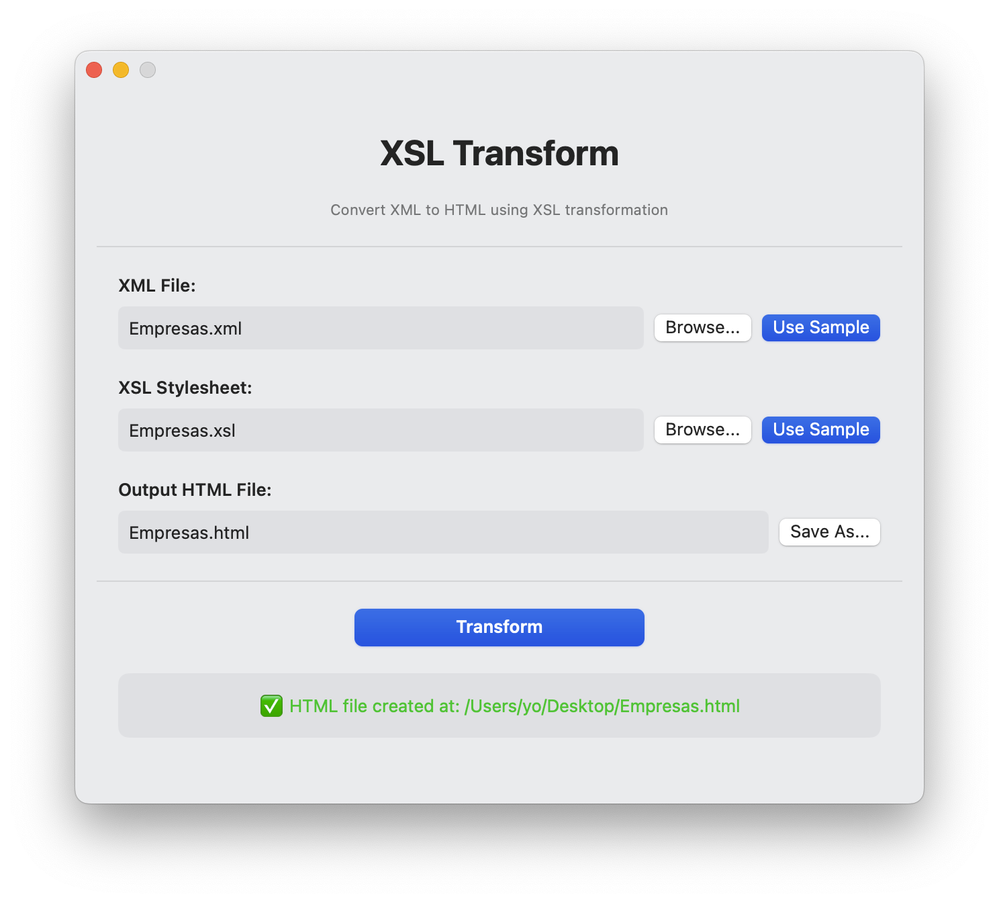
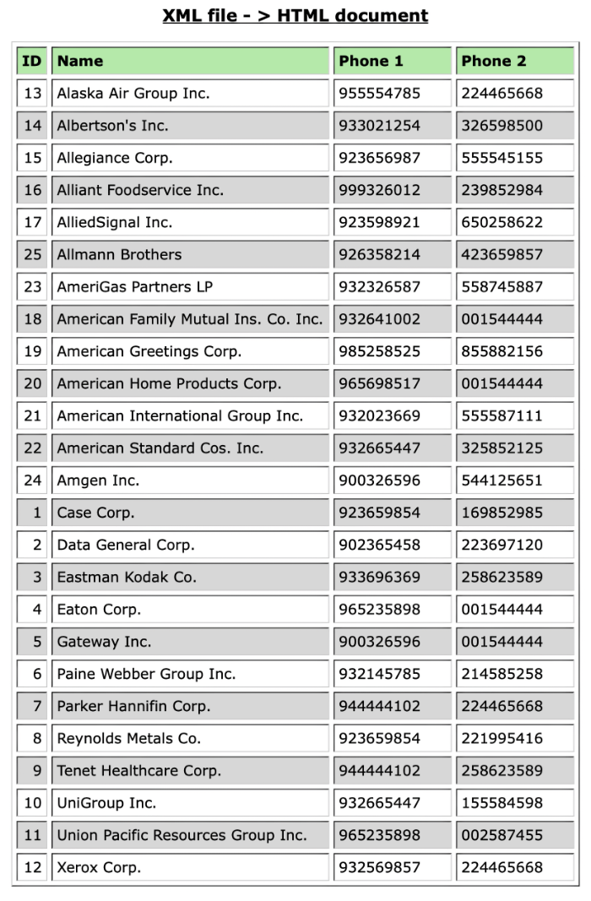

# XSL Transform - SwiftUI macOS Application

A SwiftUI application for macOS that converts XML documents to HTML using XSL transformations.





## Features

- Simple localization system (English and Spanish)
- Select XML source files
- Select XSL stylesheet files
- Choose output location for HTML files
- One-click transformation
- Includes sample files (`Empresas.xml` and `Empresas.xsl`)
- Automatically opens the generated HTML in your default browser

## Requirements

- macOS 13.0 (Ventura) or later
- Xcode 15.0 or later

## Project structure

```bash
XSL-transform-2
├── XSLTransform.xcodeproj            # Xcode project file
└── XSLTransform                      # Application directory
    ├── XSLTransformApp.swift         # Main app entry point
    ├── Info.plist                    # App configuration
    ├── Views                         # SwiftUI views
    │   └── ContentView.swift	      # Main user interface
    ├── Model                         # Business logic
    │   └── XSLTransformer.swift      # XSL transformation logic
    └── Resources                     # Resource files
        ├── Empresas.xml	          # Sample XML data
        └── Empresas.xsl	          # Sample XSL stylesheet
        ├── en.lproj	              # English localization
        └── es.lproj	              # Spanish localization
```

## How to Build and Run

### Get the Code

Clone the repository:

```bash
git clone https://github.com/perez987/XSL-transform-2.git
cd XSL-transform-2
```

### Using Xcode

1. Open the project with Xcode
2. Select your Mac as the run destination
3. Press `Cmd+R` to build and run the app

### Building from Command Line

1. Open Terminal
2. Navigate to the project directory
3. Build the project:
 
   ```bash
   swift build -c release
   ```
4. Run the application:
 
   ```bash
   .build/release/XSLTransform
   ```
   
## Sample Files

The application includes two sample files from the original project:

### `Empresas.xml`

An XML file containing contact information for 25 companies, including:

- Company ID
- Company name
- Two phone numbers per company

### `Empresas.xsl`

An XSL stylesheet that:

- Formats the XML data as an HTML table
- Sorts companies alphabetically by name
- Applies styling (fonts, colors, borders)
- Creates a professional-looking HTML document

### Expected Output: `Empresas.html`

The transformation produces an HTML file displaying a formatted table with:

- Header row with column titles (ID, Company Name, Phone 1, Phone 2)
- Data rows for all 25 companies
- Professional styling with Verdana font
- Alternating row colors for better readability

## Technical Implementation

The application uses:

- **SwiftUI** for the user interface
- **Foundation's XMLDocument** for XML/XSL processing
- **NSOpenPanel** and **NSSavePanel** for file dialogs
- **NSWorkspace** to open the generated HTML file

## How XSL Transformation Works

The transformation process:

1. Loads the XML document using `XMLDocument`
2. Loads the XSL stylesheet 
3. Applies the transformation using `XMLDocument.object(byApplyingXSLT:arguments:)`
4. Saves the resulting HTML to the specified output file
5. Opens the HTML file in the default browser

## Error Handling

The application provides error messages for:

- Invalid or missing XML or XSL files
- Transformation failures
- File write errors

## Accessibility

- All controls have proper labels for screen readers
- Keyboard navigation supported
- High contrast mode compatible
- Respects system font size settings

## Troubleshooting

### Application doesn't launch

- Check macOS version (requires 13.0+)
- Rebuild with: `swift build -c release`

### Transformation fails

- Verify XML file is well-formed
- Verify XSL file is valid XSLT 1.0
- Check file permissions

## Manual creation of an Application Bundle

To manually create a standalone .app bundle:

1. Build in release mode:

2. 
   ```bash
   swift build -c release
   ```

3. Create the app structure:

4. 
   ```bash
   mkdir -p XSLTransform.app/Contents/MacOS
   mkdir -p XSLTransform.app/Contents/Resources
   ```

5. Copy the binary:

6. 
   ```bash
   cp .build/release/XSLTransform XSLTransform.app/Contents/MacOS/
   ```

7. Create Info.plist:

   ```xml
   <?xml version="1.0" encoding="UTF-8"?>
   <!DOCTYPE plist PUBLIC "-//Apple//DTD PLIST 1.0//EN" "http://www.apple.com/DTDs/PropertyList-1.0.dtd">
   <plist version="1.0">
   <dict>
       <key>CFBundleExecutable</key>
       <string>XSLTransform</string>
       <key>CFBundleIdentifier</key>
       <string>com.example.xsltransform</string>
       <key>CFBundleName</key>
       <string>XSL Transform</string>
       <key>CFBundlePackageType</key>
       <string>APPL</string>
       <key>CFBundleShortVersionString</key>
       <string>1.0</string>
       <key>CFBundleVersion</key>
       <string>1</string>
       <key>LSMinimumSystemVersion</key>
       <string>13.0</string>
   </dict>
   </plist>
   ```
   
   Save this as `XSLTransform.app/Contents/Info.plist`

9. Double-click `XSLTransform.app` to launch

## Code Signing (Optional)

For distribution, sign the application:

```bash
codesign --force --deep --sign - XSLTransform.app
```

For App Store or external distribution, use a valid Developer ID certificate.

## License

This project is licensed under the MIT License - see the LICENSE file for details.

## Contributing

Contributions are welcome! Please feel free to submit a Pull Request.
